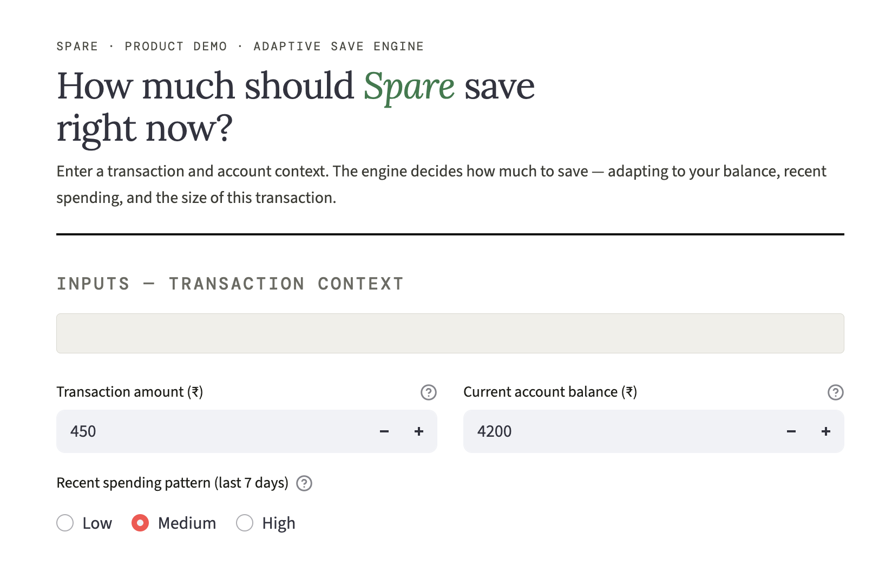
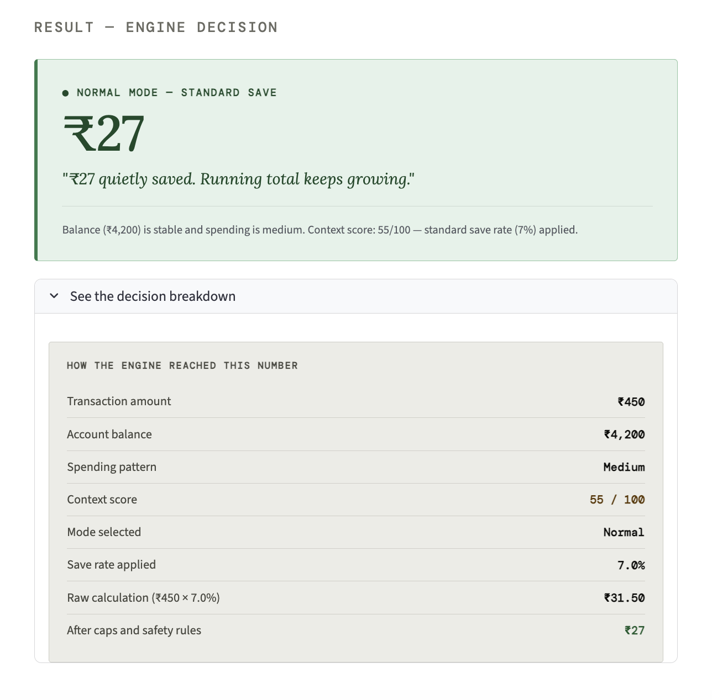
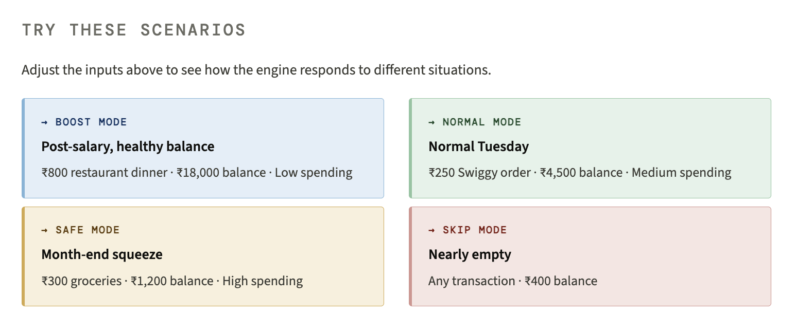

# Spare — Adaptive Save Engine

A Streamlit demo that simulates an intelligent, context-aware micro-saving system for a behavioral fintech product.

The engine replaces a fixed "save ₹10–₹50 per transaction" rule with a dynamic decision layer that reads account balance, recent spending patterns, and transaction size — then saves an amount that fits the user's financial moment.

---

## Screenshots

| Inputs | Engine decision | Scenario reference |
|--------|-----------------|--------------------|
|  |  |  |

---

## What it does

When a user makes a UPI transaction, the engine:

1. Reads the transaction amount, current account balance, and recent spending level
2. Computes a **context score** (0–100) representing financial comfort right now
3. Selects a **saving mode** — Boost, Normal, Safe, or Skip
4. Applies **hard safety rules** (balance floor, caps, minimum thresholds)
5. Returns a save amount and a plain-language explanation

The result is a saving system that feels calibrated rather than arbitrary — saving more when a user can afford it, and backing off automatically when they can't.

---

## Saving modes

| Mode | Score | Save rate | When it applies |
|------|-------|-----------|-----------------|
| **Boost** | 80–100 | ~10% | Healthy balance, low recent spending, post-salary period |
| **Normal** | 50–79 | ~7% | Stable balance, typical spending week |
| **Safe** | 20–49 | ~4% | Tighter balance or elevated spending — save a little |
| **Skip** | < 20 | 0% | Multiple stress signals — no save, no notification |

Hard limits apply in all modes: minimum save of ₹5, maximum of ₹50, and the account never dips below a ₹500 safety floor.

---

## Context score signals

The 0–100 score is built from three inputs:

- **Account balance** — the dominant signal (±35 points). Below ₹500 forces a skip regardless of other signals.
- **Spending level** — Low / Medium / High over the last 7 days (±20 points)
- **Transaction-to-balance ratio** — large relative spends reduce the score; small ones increase it (±10 points)

---

## Project structure

```
spare-adaptive-save-engine/
│
├── spare_engine.py    # Main app — engine logic + Streamlit UI
├── README.md
├── Input.png          # Screenshot — input section
├── Result.png         # Screenshot — engine decision output
├── Scenario.png       # Screenshot — scenario reference cards
└── .gitignore
```

All logic is in a single file. There are no external API calls, no database, and no ML model — just a transparent, auditable rule set that behaves intelligently.

---

## Getting started

**Requirements:** Python 3.9+

**1. Clone the repository**

```bash
git clone https://github.com/your-username/spare-adaptive-save-engine.git
cd spare-adaptive-save-engine
```

**2. Install dependencies**

```bash
pip install streamlit
```

**3. Run the app**

```bash
streamlit run spare_engine.py
```

The app opens automatically at `http://localhost:8501`.

---

## Using the demo

The UI has three inputs:

| Input | What it represents |
|-------|--------------------|
| Transaction amount (₹) | The spend that just happened |
| Current account balance (₹) | Account balance at the time of the transaction |
| Recent spending pattern | Low / Medium / High over the last 7 days |


Adjust the sliders and see the engine's decision update in real time. Use the **"See the decision breakdown"** expander to inspect the full scoring chain — context score, mode selected, save rate applied, and how each safety rule affected the final amount.


**Suggested scenarios to try:**

- `₹800 transaction · ₹18,000 balance · Low spending` → Boost mode, maximum save
- `₹250 transaction · ₹4,500 balance · Medium spending` → Normal mode, standard save
- `₹300 transaction · ₹1,200 balance · High spending` → Skip (multiple stress signals)
- `Any transaction · ₹400 balance` → Skip (below safety floor)


---

## Engine design decisions

**Why rule-based, not ML?**
A scoring model is auditable — you can trace exactly why any save happened. For a product handling real money, explainability is a trust requirement, not a nice-to-have. ML can be layered in at v2 once there is 90+ days of behavioral data to train on.

**Why a hard balance floor?**
Saving when a user is nearly empty would cause financial stress, not build a saving habit. The ₹500 floor is non-negotiable — the system skips silently, with no notification, so the user never sees a "failed save" state.

**Why silent skips?**
Showing a "save paused" notification at a moment of financial pressure draws attention to exactly the anxiety the product is trying to remove. The skip is invisible; the loop resumes automatically on the next transaction.

**Why a ₹50 hard cap?**
A percentage-based rate on a large transaction (e.g., ₹8,000 grocery run) could produce a ₹800 save. That would feel like the product is "grabbing" money. The cap ensures saves always feel small and safe.

---

## Key functions

### `compute_context_score(balance, spending_level, transaction_amount) → int`

Returns a score from 0–100. Higher score means more capacity to save. Scores below 20 result in a silent skip; the scoring breakdown is shown in the UI expander.

### `compute_save_amount(transaction_amount, balance, spending_level) → dict`

Main decision function. Returns:

```python
{
    "save_amount":   int,    # ₹ to move to savings (0 if skipped)
    "mode":          str,    # "Boost" | "Normal" | "Safe" | "Skip"
    "base_rate":     float,  # percentage applied
    "context_score": int,    # 0–100 score
    "notification":  str,    # user-facing message (None if skipped)
    "reason":        str,    # plain-language explanation of the decision
}
```

---

## Product context

This demo is part of a broader product design project for **Spare** — a behavioral fintech app that automatically saves small amounts of money after UPI transactions, with zero effort required from the user.

The Adaptive Save Engine is the technical implementation of a product principle: *saving should feel calibrated to the user's real financial life, not imposed by an arbitrary rule.*

The full product design includes:
- A user research pipeline (Reddit scraping + thematic analysis)
- A full PRD with behavioral design principles
- Microcopy library (30+ notification variants)
- Trust & withdrawal flow specification
- A PM portfolio case study

---

## Contributing

This is a demo project, not a production system. Issues and pull requests are welcome — especially improvements to:

- The scoring model logic
- Edge case handling
- Streamlit UI polish
- Additional test scenarios

---

## License

MIT — free to use, adapt, and build on.
